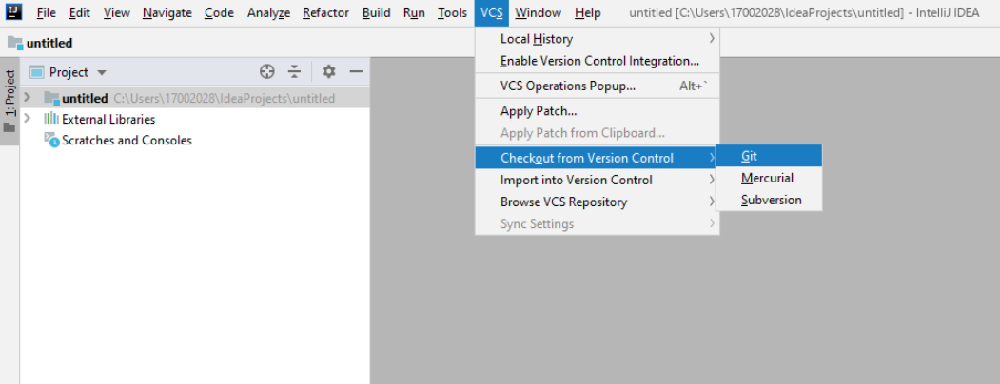

# INSTALL 

For the project you can use <a href="#eclipse">Eclipse</a> or  <a href="#intellij">IntelliJ</a> . 

## Choose your framework

<h3 id=eclipse> For Eclipse </h3>

First, you have to add the git repository to Eclipse. It's important to have the view visible on your Eclipse. For that, from the menu 'Window > Show views > Other > Git > Git Repositories'. <br/><br/>

1. You can clone the projet: in the view select "Clone a Git Repository" on Eclipse.
<br><br>

2.  For this project the URI is : https://github.com/EliseChap/PDL_2018-2019_GR1. Then click on next. 
<br><br>

3. Don't forget to select the box <b> Import all existing Eclipse projects after clones finishes </b>. Then select Finish. 
<br> <br>


<h3 id=intellij> For IntelliJ </h3>

1. From the main menu, choose the menu VCS, then Checkout from Version Control and then choose Git. <br/>
<br><br>

2. In the Clone Repository dialog, specify the URL of the repository that you want to clone. For this project the URI is : https://github.com/EliseChap/PDL_2018-2019_GR1. In the Directory field, enter the path to the folder where your local Git repository will be created. Then click Clone. 

## Getting Started

First you have to launch the class App. 

Then you have to enter different commands in the terminal. 

<h3> Select the URL you want to convert </h3>

You have the choice to convert one or several Wikipedia pages. <br/>

If you want to convert one page you must enter the following command : 

```
wikimatrix-url[Address]
```

If you want to convert more than one Wikipedia page you must enter : 

```
wikimatrix-import[C://FileAddress]
```
When using the command -import [C: // FileAddress] this extracts the list of URLs from a file. In order to standardize the input file, it was decided in the first version of our application to be limited to "txt" format. Inside this file, the data will be delimited by the "; '" character. Thus each URL will be separated by this character.

<b> Attention, the import and url commands can not be realized at the same time. </b>

<h3> Choose html and / or Wikicode extraction </h3>

Then you have to choose between an html extraction or a wikicode extraction. If you choose an html extraction and to extract from one page, then you must unter this in your terminal : 

```
-html
```

Example : 

```
wikimatrix-url[Adress]-html
```

If you choose a wikicode extraction and to extract from a txt file, then you must unter this in your terminal : 

```
-wikicode
```
Example : 

```
wikimatrix-import[C://]-wikicode
```

The -html and -wikicode commands can be cumulated to have both extractions simultaneously on the same tables.

<h3> Choose the delimiter in the final CSV </h3>

Optional. Buy default, the delimiters are two points but you can change it with the following command: 

```
-delimit[;] : 
```

Example : 

```
wikimatrix-import[C://]-wikicode-delimit[;]; 
```
<h3> Choose where the CSV file is registered </h3>

Optional. Buy default the CSV file is registered under the file output but you can change the destination file with the following command : 

```
-save[C://] :
```
Example : 

```
wikimatrix-import[C://]-wikicode-save[C://]; 
```

<h3>Register the CSV (s) under a name</h3>

Optional. Buy default the name of the CSV file is the name of the table in the Wikipedia page.You can change the name of the file with the following command : 

```
-name[fichier.csv] :
```


<h3>Examples of commands accepted by the application </h3>

```
wikiMatrix-import[C:\Users\Documents\Dossier cours\liens.txt]-html 
```

This command allows the creation of CSV files from URLs that have "links.txt". The extraction will be done from the HTML code. All other parameters will be defined by their default value.

```
wikiMatrix-url[https://fr.wikipedia.org/wiki/Rennes]-html-wikicode-delimit[;]-save[C:\ Users\Sophie\Documents\] 
```
The program extracts the URL and parses the page with both algorithms. Using this command, the user sets the delimiter and the save location.

## Running the tests

To start the test, you have to enter:
```
mvn test
```
*Then, it exists different type of test:* <br>

Launch the 300 Urls, general test
```
BenchTest
```
Test The Line Command class to check if the command is validated
```
TestCommandLine
```
Test the Html and WikiText comparison
```
TestComparateur
```
Test the creation of CSV
```
TestCsv
```
Test the class Extractor
```
TestExtracteur
```
Test reading urls
```
TestFichier
```
Html extraction test
```
TestHtml
```
Test the creation of Tableau
```
TestTableau
```
Extracting the url to the extractor
```
TestUrl
```
Test the Wikitext class
```
TestWikitext
```


