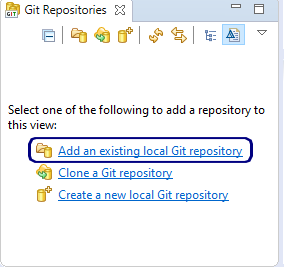
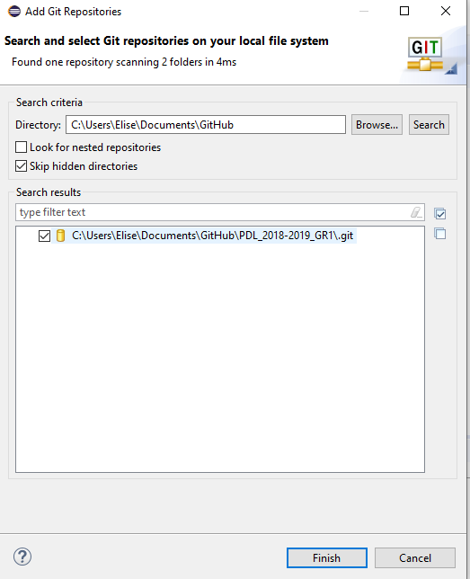
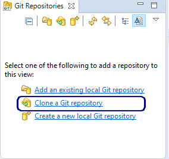
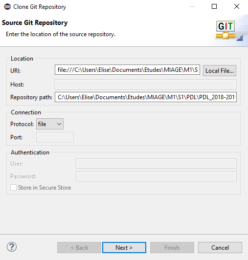

Comment on construit le projet à partir du code source?
Comment on exécute les suites de tests?
Comment on exécute le logiciel?

# INSTALL 

For the project you can use <a href="#eclipse">Eclipse</a> or  <a href="#intellij">IntelliJ</a> . 

## Get the project 

<h3 id=eclipse> For Eclipse </h3>

First, you have to add the git repository to Eclipse. It's important to have the view visible on your Eclipse. For that, from the menu 'Window > Show views > Other > Git > Git Repositories'. <br/><br/>
If you have github desktop you can clone the project, in the view select "Add an existing local Git Repository" and choose your project.
<br/>
<br><br>
<br><br>

1. If you don't use the github desktop you can download the projet, in the wiew select "Clone a Git Repository" and choose your project.<br><br>

2.  For this project the URI is : https://github.com/EliseChap/PDL_2018-2019_GR1. Then click on next. 
<br><br>

3. Don't forget to select the box <b> Import all existing Eclipse projects after clones finishes </b>. Then select Finish. 
<br> <br>


<h3 id=intellij> For IntelliJ </h3>

1. From the main menu, choose the menu VCS, then Checkout from Version Control and then choose Git. <br/>
<br><br>


2. In the Clone Repository dialog, specify the URL of the repository that you want to clone. For this project the URI is : https://github.com/EliseChap/PDL_2018-2019_GR1. In the Directory field, enter the path to the folder where your local Git repository will be created. Then click Clone. 

## Launch the App
Now you can use the app. 


## Running the tests

To start the test, you have to enter:
```
mvn test
```
*Then, it exists different type of test:* <br>

Launch the 300 Urls, general test
```
BenchTest
```
Test The Line Command class to check if the command is validated
```
TestCommandLine
```
Test the Html and WikiText comparison
```
TestComparateur
```
Test the creation of CSV
```
TestCsv
```
Test the class Extractor
```
TestExtracteur
```
Test reading urls
```
TestFichier
```
Html extraction test
```
TestHtml
```
Test the creation of Tableau
```
TestTableau
```
Extracting the url to the extractor
```
TestUrl
```
Test the Wikitext class
```
TestWikitext
```


