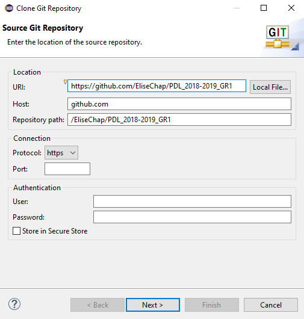
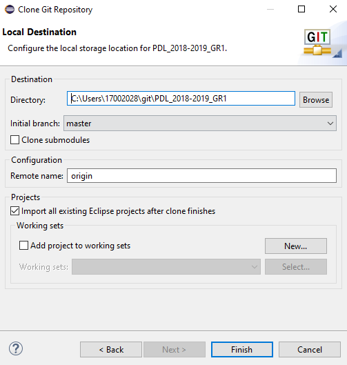

Comment on construit le projet à partir du code source?
Comment on exécute les suites de tests?
Comment on exécute le logiciel?

# INSTALL 

For the project you can use <a href="#eclipse">Eclipse</a> or  <a href="#intellij">IntelliJ</a> . 

## Get the project 

<h3 id=eclipse> For Eclipse </h3>

First, you have to add the git repository to Eclipse. It's important to have the view visible on your Eclipse. For that, from the menu 'Window > Show views > Other > Git > Git Repositories'. <br/><br/>
If you have github desktop you can clone the project, in the view select "Add an existing local Git Repository" and choose your project.
<br/>
<br><br>
<br><br>

1. If you don't use the github desktop you can download the projet, in the wiew select "Clone a Git Repository" and choose your project.<br><br>

2.  For this project the URI is : https://github.com/EliseChap/PDL_2018-2019_GR1. Then click on next. 
<br><br>

3. Don't forget to select the box <b> Import all existing Eclipse projects after clones finishes </b>. Then select Finish. 
<br> <br>


<h3 id=intellij> For IntelliJ </h3>

1. From the main menu, choose the menu VCS, then Checkout from Version Control and then choose Git. <br/>
<br><br>

2. In the Clone Repository dialog, specify the URL of the repository that you want to clone. For this project the URI is : https://github.com/EliseChap/PDL_2018-2019_GR1. In the Directory field, enter the path to the folder where your local Git repository will be created. Then click Clone. 

## Launch the App
## Getting Started

** Launch the class App **

** Enter one or more URLs. **

## The commands to be filled in the terminal.

** Import a .txt file where all the URLs are stored: **

```
-import[C://FileAddress]
```

When using the command -import [C: // FileAddress] this extracts the list of URLs from a file. In order to standardize the input file, it was decided in the first version of our application to be limited to "txt" format. Inside this file, the data will be delimited by the "; '" character. Thus each URL will be separated by this character.

**URL**  

```
-url[Address]
```

**Choose html and / or Wikicode extraction**  

```
-html 
```

Extraction of data by HTML code

```
-wikicode
```

Extraction of data by Wikicode code


**Choose the delimiter in the final CSV**

```
-delimit[,] : 
```

**Register the CSV**

```
-save[c//] :
```

**Register the CSV (s) under a name**

```
-name[fichier.csv] :
```

Attention, the import and url commands can not be realized at the same time. The -html and -wikicode commands can be cumulated to have both extractions simultaneously on the same tables.

**Examples of commands accepted by the application:**

```
WikiMatrix -import[C:\Users\Documents\Dossier cours\liens.txt] -html 
```

This command allows the creation of CSV files from URLs that have "links.txt". The extraction will be done from the HTML code. All other parameters will be defined by their default value.

```
WikiMatrix -url[https://fr.wikipedia.org/wiki/Rennes] -html -wikicode -delimit[;] -save[C:\ Users\Sophie\Documents\] 
```
The program extracts the URL and parses the page with both algorithms. Using this command, the user sets the delimiter and the save location.


## Running the tests

To start the test, you have to enter:
```
mvn test
```
*Then, it exists different type of test:* <br>

Launch the 300 Urls, general test
```
BenchTest
```
Test The Line Command class to check if the command is validated
```
TestCommandLine
```
Test the Html and WikiText comparison
```
TestComparateur
```
Test the creation of CSV
```
TestCsv
```
Test the class Extractor
```
TestExtracteur
```
Test reading urls
```
TestFichier
```
Html extraction test
```
TestHtml
```
Test the creation of Tableau
```
TestTableau
```
Extracting the url to the extractor
```
TestUrl
```
Test the Wikitext class
```
TestWikitext
```


